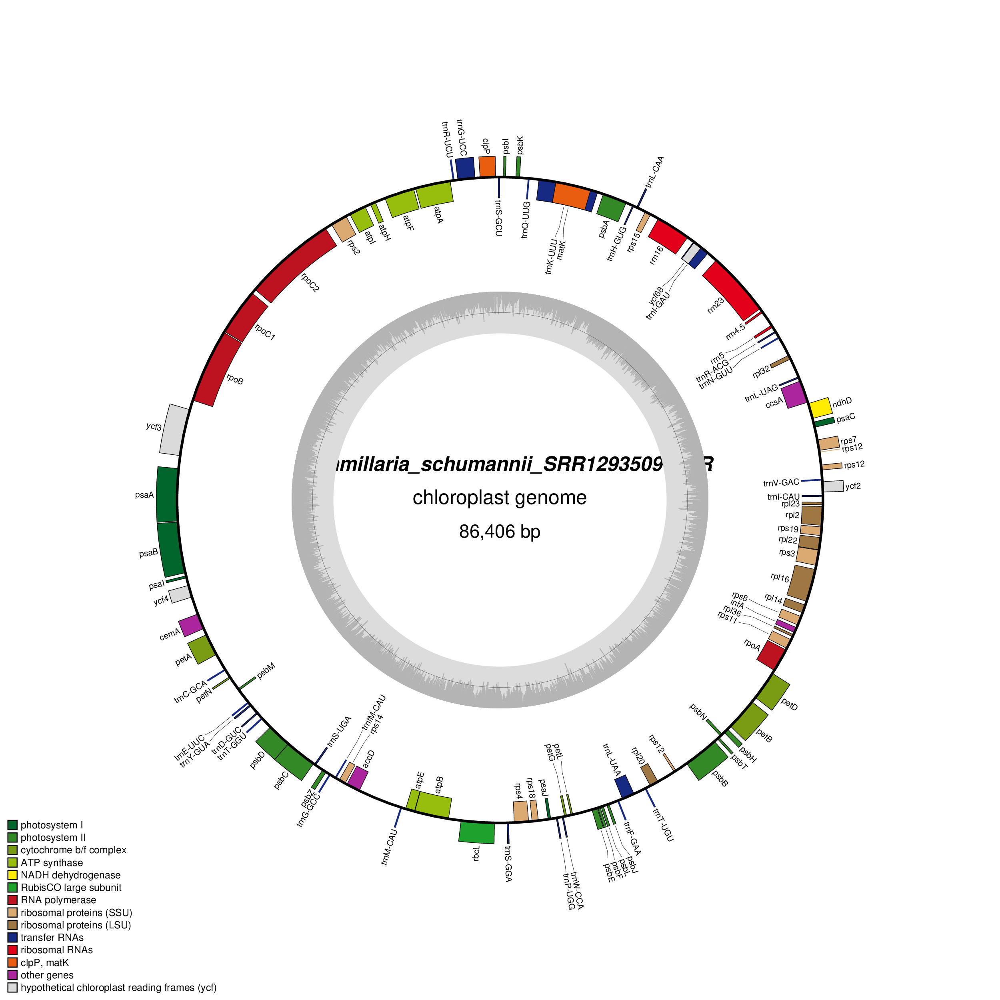

## Comparative genomics in cactus

 \
This is the repository associated to the article *Comparative genomics of chloroplast structural evolution in cactus* submitted to [*scientific reports*](https://www.nature.com/srep/).

**Background** \
*Mammillaria* is the most diverse and emblematic genus within the cactus family (Cactaceae). Consequently, this system provides an excellent framework for elucidating the factors and processes that promote high species diversity. Unfortunately, it is also one of the most threatened cactus genera. The [IUCN](https://www.iucnredlist.org/) currently includes 1,478 taxa of Cactaceae, of which 58 belong to the genus *Mammillaria*. Therefore, immediate efforts are required to ensure the protection and conservation of these species. It is also of great importance to integrate the extensive information generated on their genomic variation, phylogeny, and distribution into innovative evolutionary analyses that can improve our understanding of the processes underlying their diversification and inform conservation strategies.

Recent publications have shown that the chloroplast genome (cpDNA) is more variable in gene content and arrangements than previously recognized, particularly in Cactaceae. In this study, we investigated the evolution of chloroplast genome structure, using a comparative phylogenetic approach to analyze 102 annotated chloroplast plastomes across the Mammilloid clade (Cactaceae). 

This repository includes the data and scripts generated for the manuscript (preprocessing of samples, assembly and chloroplast genome annotation) and is structured in three directories: bin, metadata, results and results. The content of each directory is delailed below. 

**/bin:** \
Contain files to assembling and annotated cpDNA from row data sequences. \
***1_reads_preprocessing_and_assembly.txt***: Runs a workflow consisting of five main steps for chloroplast genome assembly: (1) setting environment variables and creating output directories and paths; (2) downloading and assessing sequencing data published by [Breslinn et al., (2021)](https://onlinelibrary.wiley.com/doi/10.1002/tax.12451) and [Chincoya et al (2023)](https://pubmed.ncbi.nlm.nih.gov/37106713/); (3) preprocessing and trimming reads using [TrimGalore](https://github.com/FelixKrueger/TrimGalore) version 0.4.3; (4) assembling chloroplast genomes with [GetOrganelle](https://github.com/Kinggerm/GetOrganelle) version 1.7.1; and (5) evaluating assembly quality using [Bandage](https://github.com/rrwick/Bandage#2022-update). \
***2_genome_assembly_various_values.txt***: This script executes steps 4 and 5 of the previous loop, but testing multiple w values (33, 35, 40, ..., 105, and 110) with [GetOrganelle](https://github.com/Kinggerm/GetOrganelle) version 1.7.1 during chloroplast genome assembly and evaluating assembly completeness and circularization with [Bandage](https://github.com/rrwick/Bandage#2022-update). \
***3_pga_annotation.txt***: We employed two annotators: 1) [GeSeq](https://chlorobox.mpimp-golm.mpg.de/geseq.html) from Chlorobox and 2) [PGA](https://github.com/quxiaojian/PGA), which works through the command line. The present loop is used to extract FASTA files from assembled genomes and annotate them. \
**/metadata:** \
Contains a CSV file listing the GenBank accession numbers of the raw sequencing data used for all analyzed species. \
**/scripts:** \
Contains a Python script for comparing nucleotide sequence identity, length, and gene annotation between the two inverted repeat (IR) regions. \
**/chloroplast_genomes** \
This directory contains annotated chloroplast genome maps in PNG format (.png). \
**/references** \
This directory contains annotated chloroplast genome maps in genebank and fasta formats dowloaded from genebank. \
**gb files** \
GenBank format files (.gb) are available upon request from the corresponding author.

**References** \
Breslin PB, Wojciechowski MF, Majure LC. (2021). [Molecular phylogeny of the Mammilloid clade (Cactaceae) resolves the monophyly of *Mammillaria*](https://onlinelibrary.wiley.com/doi/10.1002/tax.12451). Taxon 70: 308–323. https://doi.org/10.1002/tax.12451. \
Chincoya, DA, Arias S, Vaca-Paniagua F, Dávila P, Solórzano S (2023). [Phylogenomics and Biogeography of the Mammilloid Clade Revealed an Intricate Evolutionary History Arose in the Mexican Plateau.](https://pubmed.ncbi.nlm.nih.gov/37106713/) Biology 12(4): 512. https://doi.org/10.3390/biology12040512. 
